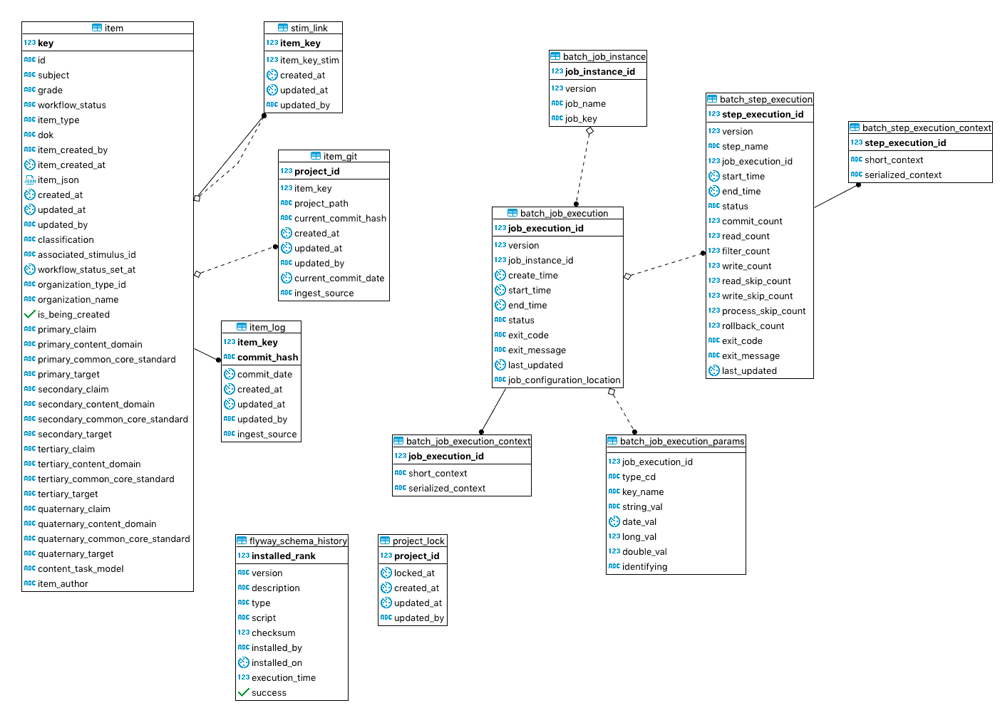

# IMRT Database

[Go Back](Architecture.md)

IMRT uses Postgres 9.6.  The schema migration files can be found in the [AP\_IMRT\_Schema](https://github.com/SmarterApp/AP_IMRT_Schema) project.  Information concerning how to create the tables can be found in the README in the project.

All tables are in the **imrt** schema.

There are three types of tables in the system:

* Item Tables - tables containing item data
* Job Tables - tables used during the sync process
* Application Tables - tables that are used as part of the application

## Schema Design
The scheam image below was created using [DBeaver](https://dbeaver.io/) free SQL Editor.  It can be downloaded and run to create the Entity Relationship Diagram (ERD).

## Item Tables
The item tables contain data related to the item.  These tables are populated during the item ingest from the itembank.  The itembank is currently a hosted Gitlab server, and some of the tables are related to the itembank information gathered from the Gitlab service.

The table below desrcibes what each table represents:

| Table| Description |
| --- | --- |
| item | contains the searchable item data |
| stim_link | contains the stim and item relationship when present |
| item_git | contains data about the itembank location within Gitlab |
| item_log | contains the git commit history for the item |

### item Table
The columns in this table represent searchable fields within IMRT.  The data is ingested from the item.json or derived from the data within the item.json.  IMRT does not alter the data ingested into the system.  For example, workflow status as stored in item.json will be the workflow status stored in the system.  

The table below describes the data stored in this table.  The canonical name of the column can be used to get the list of acceptable values and proper definitions of the data.  All columns in this table are not null.

| Column Name | Item Data Dictionary Canonical Name | Data Type | Description |
| --------- | ---------- | ------- | ------- |
| `key` | n/a | long | auto increment primary key for the table |
| `subject` | subject | varying character | items subject | 
| `grade` | intendedGrade | varying character | item's intended grade |
| `workflow_status` | workflowStatus | varying character | item's current workflow status |
| `item_type` | type | varying character | item's item type |
| `dok` | depthOfKnowledge | varying character | item's depth of knowledge | 
| `item_created_by` | n/a | varying character | the gitlab user that created the item in the itembank |
| `item_created_at` | n/a | timestamp | the UTC timestamp for when the item was created | 
| `item_json` | n/a | jsonb | The current item.json in its entirety as stored in the item bank |
| `created_at` | n/a | timestamp | general create timestamp audit column |
| `updated_at` | n/a | timestamp | general update timestamp audit column |
| `updated_by` | n/a | varying character | the gitlab user that last updated the item |
| `classification` | n/a | varying character | application field used to tell between assessment item and other specific items like stimulus|
| `associated_stimulus_id` | stimulusId | varying character | the id of the associated stimulus id |
| `workflow_status_set_at` | n/a | timestamp | the UTC timestamp the workflow status was most recently set |
| `organization_type_id` | organizationTypeId | varying character | the item's organization type id |
| `organization_name` | organizationName | varying character | the item's organization name |
| `is_being_created` | n/a | boolean | whether the item is being created and not yet published to the itembank |
| `primary_claim` | primaryClaim | varying character | the item's primary claim id |
| `primary_content_domain` | primaryContentDomain | varying character | the item's primary content domain |
| `primary_common_core_standard` | primaryCommonCoreStandard | varying character | the item's primary common core standard |
| `primary_target` | primaryTarget | varying character | the item's primary target |
| `secondary_claim` | secondaryClaim | varying character | the item's secondary claim id |
| `secondary_content_domain` | secondaryContentDomain | varying character | the item's secondary content domain |
| `secondary_common_core_standard` | secondaryCommonCoreStandard | varying character | the item's secondary common core standard |
| `secondary_target` | secondaryTarget | varying character | the item's secondary target |
| `tertiary_claim` | tertiaryClaim | varying character | the item's tertiary claim id |
| `tertiary_content_domain` | tertiaryContentDomain | varying character | the item's tertiary content domain |
| `tertiary_common_core_standard` | tertiaryCommonCoreStandard | varying character | the item's tertiary common core standard |
| `tertiary_target` | tertiaryTarget | varying character | the item's tertiary target |
| `quaternary_claim` | quaternaryClaim | varying character | the item's quaternary claim id |
| `quaternary_content_domain` | quaternaryContentDomain | varying character | the item's quaternary content domain |
| `quaternary_common_core_standard` | quaternaryCommonCoreStandard | varying character | the item's quaternary common core standard |
| `quaternary_target` | quaternaryTarget | varying character | the item's quaternary target |
| `item_author` | itemAuthor | varying character | the item author field within the item.json |

### stim_link Table
This is a "join table" that links an item with its stimulus or vice versa.  

| column | type | description |
| ------| ------| ------|
| item_key | long | foriegn key to the item's `key` column representing the assessment item |
| item_key_stim | long | foreign key to the item's `key` column representing the stimulus |
| created_at | timestamp | UTC timestamp audit field for create date |
| updated_at | timestamp | UTC timestamp audit field for update date |
| updated_by | varying character | gitlab user that created/updated the stim association |

### item_git Table
This table contains information about the item's itembank location.  This is currently leveraging Gitlab and contains fields about the commit hash, project information, and ingest source.

| column | type | description |
| ------| ------| ------|
| item_key | long | foriegn key to the item's `key` column |
| project_id | varying character | the gitlab project containing the item |
| current_commit_hash | varying character | the most recent ingested item's git commit hash |
| created_at | timestamp | UTC timestamp audit field for create date |
| updated_at | timestamp | UTC timestamp audit field for update date |
| updated_by | varying character | gitlab user that created/updated the item |
| current_commit_date | timestamp | UTC timestamp when the last commmit happened |
| ingest_source | varying character | the branch used ot ingest the item |

### item_log Table
This table contains all the git commit hashes that has been processed for an item.

| column | type | description |
| ------| ------| ------|
| item_key | long | foriegn key to the item's `key` column |
| commit_hash | varying character | item's ingested git commit hash |
| commit_date | timestamp | the UTC timestamp for the git commit |
| created_at | timestamp | UTC timestamp audit field for create date |
| updated_at | timestamp | UTC timestamp audit field for update date |
| updated_by | varying character | gitlab user that commited the change to the item |
| ingest_source | varying character | the branch used ot ingest the item |

## Job Tables
IMRT leverages Spring Batch to handle the initial load of data into the system from the itembank and the nightly sync that runs to ensure no item changes were missed.  The tables associated with this are below.  Please refer to the [Spring Batch documentation](https://docs.spring.io/spring-batch/4.0.x/reference/html/schema-appendix.html#metaDataSchema) for more inforamtion.

| table | description |
| ------ | ------ | 
| batch_job_instance | serves as top of the overall hierarchy |
| batch_job_execution | contains information for each execution of a job |
| batch_job_execution_params | holds all information relevant to the JobParameters object
| batch_job_execution_context | contains data around the execution context of a job |
| batch_step_execution | contains information for each step of an executed job |
| batch_step_execution_context | contains data around the execution context of a step |

## Application Tables
These table are used as part of the application during setup or processing.  The table below lists out the table and what they're used for within the application.

| table | description |
| ------ | ------ | 
| project_lock | works as a lock table so that an item is processed on a single thread to avoid conflicts|
| flyway_schema_history | IMRT uses Flyway migrations to migrate the schema.  More information about this table can be found [here](https://flywaydb.org/documentation/).