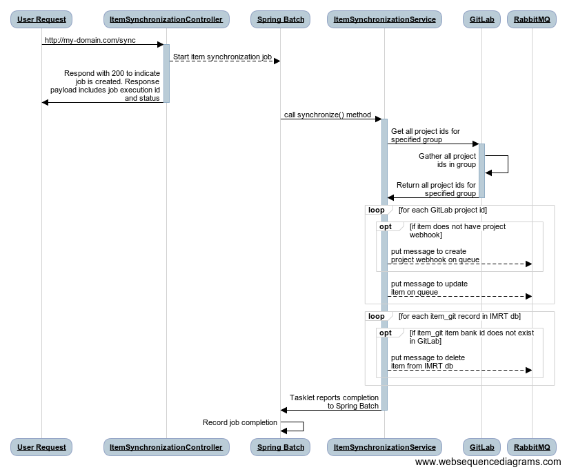

# Item Synchronization Process

[Go Back](Architecture.md)

## Overview
The Item Synchronization Process is responsible for ensuring that the IMRT database (which the [Item Search Service](https://github.com/SmarterApp/AP_IMRT_ItemSearchService) relies on) reflects the item data stored in source control (e.g. GitLab).  The Item Synchronization Process iterates over every item (referred to as a "project" in GitLab) in source control and executes the ingest process for each one.  When the Item Synchronization Process is complete, the IMRT database will accurately reflect the items stored in source control.

## Architecture/Implementation
The Item Synchronization Process is a [Spring Batch](https://projects.spring.io/spring-batch/) job with a single step.  The details of the operations performed by the step are described in the **Workflow** section below.

### Workflow
The Item Synchronization process is initiated by an `HTTP POST` request to the `sync` endpoint of the Item Ingest Service.  The `sync` endpoint does not accept any arguments.  After the `POST` to `sync` is received, the following steps occur:

1. The `ItemSynchronizationController` will start a new instance of the Item Synchronization Process job
2. The Item Synchronization Process job is started asynchronously by a Spring Batch `JobLauncher`
3. If the job started successfully, the `ItemSynchronizationController` will respond with a `200`.  The response payload will contain the job execution id and its status.  An example response payload is shown below:

	```json
	{"jobExecutionId":6,"name":"itemSynchronizationJob","status":"STARTING"}
	```
	 
4. The `ItemSynchronizationService#synchronize` method is called, which does the following:
    1. Fetch all project ids (GitLab's unique identifier for an item) from GitLab for the configured Project Group
    2. For each project id:
        1.  Determine if the item has a project webhook created.  If not, put a "monitor item" message on the RabbitMQ queue
        2. Put an "update item" message on the RabbitMQ queue
    3. Fetch all the `item_git` records from the `imrt` database
    4. Identify any `item_git` records with an item bank id that does not exist in GitLab (that is, the item exists in `imrt`, but not in GitLab)
    5. Put a "delete item" message on the RabbitMQ queue for each item bank id identified in the previous step

Once the messages have been put on the RabbitMQ queue, the Item Synchronization Process is complete.  The Item Ingest Process will read each message, evaluate it and perform the appropriate action:

* **Monitor Item:** This message will use the GitLab API library (implemented in the [AP\_IMRT\_ItemIngestService](https://github.com/SmarterApp/AP_IMRT_ItemIngestService/blob/develop/src/main/java/org/opentestsystem/ap/imrt/iis/client/GitlabClientImpl.java)) to create a new project webhook for the item.
* **Update Item:** This message will verify the item records in the `imrt` database are up-to-date with the most recent revision for the item.  If the item does not exist in the database, new records will be created.
* **Delete Item:** This message will delete an item from the `imrt` database.

Shown below is a sequence diagram of the steps described above:



***NOTE:*** The message listener that intercepts the messages put on the queue by the Item Synchronization Process has been omitted for clarity.

### Database
Aside from the [Spring Batch metadata tables](https://docs.spring.io/spring-batch/trunk/reference/html/metaDataSchema.html), the Item Synchronization Process does not rely on any special database objects.  The Spring Batch metadata tables are used to track the Item Synchronization Process's execution, progress, status, etc.

### Restrictions
There can only be one instance of the Item Synchronization Process job running at one time.

## Configuration
The item synchronization process is part of the [AP\_IMRT\_ItemIngestService](https://github.com/SmarterApp/AP_IMRT_ItemIngestService), thus shares its configuration properties.  Refer to the AP\_IMRT\_ItemIngestService `README.md` for details on configuration options.

As previously stated, the Item Synchronization Process relies on Spring Batch.  There are two settings specific to Spring Batch that need to be configured:

* Prevent Spring Batch from starting the Item Synchronization Process whenever the Item Ingest Service starts up
* Prevent Spring Batch from trying to create its database schema on startup (these tables are created as part of the [AP\_IMRT\_Schema project](https://github.com/SmarterApp/AP_IMRT_Schema))

These configuration settings are detailed below:

```yaml
spring:
  batch:
    job:
      enabled: false # Prevent Spring from starting jobs on startup.
    initialize-schema: "never" # Prevent Spring from creating the spring batch schema on startup.
  # other spring-related settings here...
```

The Spring Batch configuration settings described above will typically be included in the `yml` file served up by IMRT's Spring Cloud Configuration service.  When working in a local development environment (e.g. running the Item Ingest Service in IntelliJ), the settings can be included in an `application.yml` file.